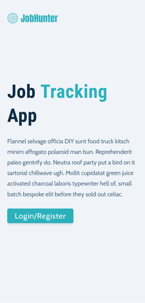
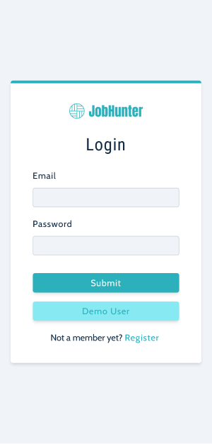
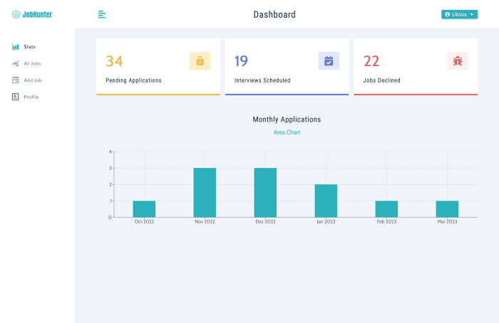
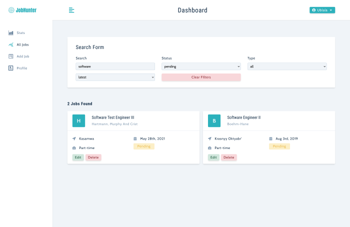
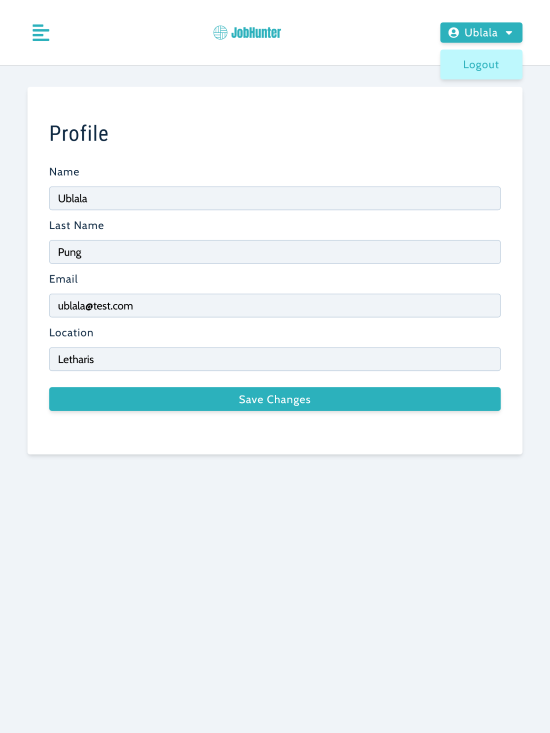

# Job Hunter - A Job tracker Platform✅✅

🔗 [Visit my website👍👍✅](https://job-hunter.herokuapp.com/landing)

# Job-Hunter App👍

This web-app is designed to keep track of a users job application status. A user that is hunting for a job can enter information about that job including the name of the company, the location of the job, type of job (full-time, part-time, internship), the title of the position and the status of the application (Pending, Interview or declined). The app records and displays all jobs that have been applied for and shows stats for the past 6 months of job applications in a bar or area graph as per the users choice. The user can also search and/or sort through all jobs in the database.

## Table of contents

- [Job-Hunter App](#job-hunter-app)
  - [Table of contents](#table-of-contents)
  - [Overview](#overview)
    - [The challenge](#the-challenge)
    - [Screenshot](#screenshot)
    - [Links](#links)
    - [Built with](#built-with)
    - [What I learned](#what-i-learned)
    - [Continued development](#continued-development)
    - [Useful resources](#useful-resources)

## Overview✅✅

### The challenge👍👍

Users should be able to:

- Securely register and login to web-app
- Ability to add and edit and delete jobs
- Change user profile and update DB
- Search through all jobs using any one of the search fields

### Screenshot✅✅

### Links✅✅

- Solution URL: [Github-rep](https://github.com/dikshant-4848/Job-Hunter)
- Live Site URL: [Live-Link](https://job-hunter.herokuapp.com/landing)

### Built with✅✅

- [React](https://reactjs.org/) (Create-React-App)
- [React Router ]
- MongoDB Atlas
- Mongoose 
- Express
- React Context API
- "express-async-errors" package
- [Mockaroo](https://mockaroo.com/) - For creating test data. This is awesome if you haven't seen it before.
- [Render](https://render.com/) - Hosting service
- [Styled Components](https://styled-components.com/) - For styles

### Useful resources✅✅

- [Mockaroo](https://mockaroo.com/)
- [Styled Components](https://styled-components.com/)

## Author✅✅

- [Dikshant rajput](https://github.com/dikshant-4848)

